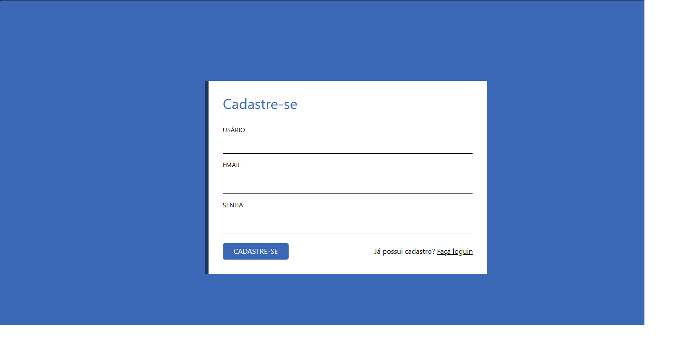
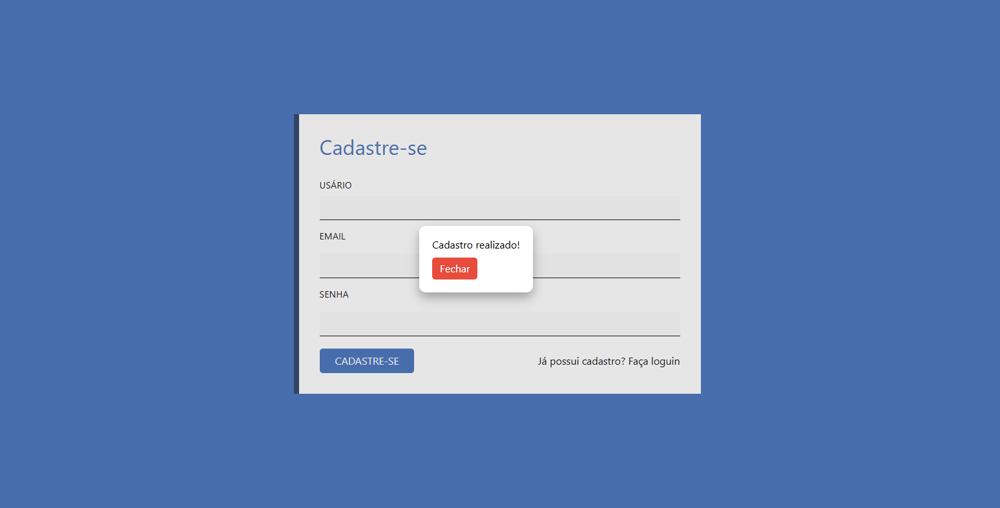
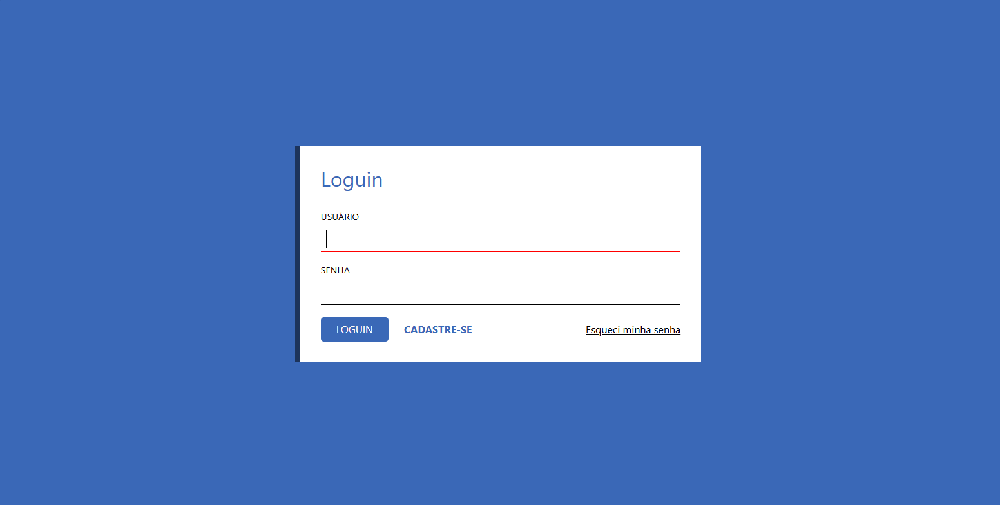
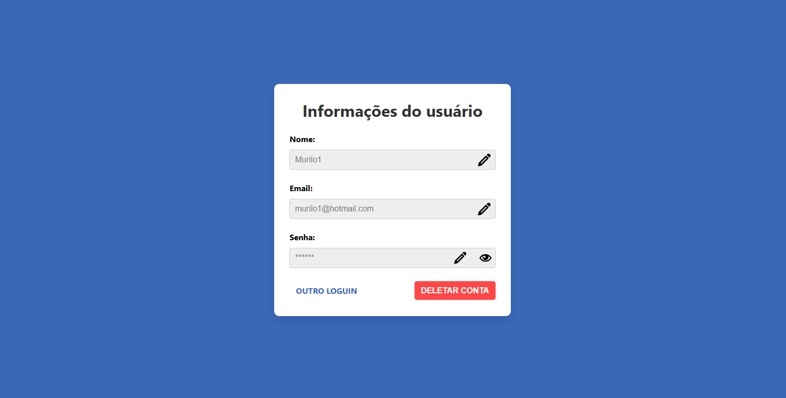

# Projeto Users Api Node

### 📝 Descrição

Este projeto é uma API REST construída com **Node.js + Express** usando **TypeScript**.  
O projeto também inclui um front-end rodando em **Vite**, executado em paralelo através do **concurrently**.

### 👀 Demonstração

#### Seção de Interação/Funcionalidade

**Cadastro**

Visão geral da tela de cadastro, com animação e validação nos campos.




**Login**

Visão geral da tela de loguin, utilizando de validações das informações cadastradas.



**Usuário**

Visão geral da tela de informações do usuario, permite que o usuário alterar informações de cadastro



### 💻 Tecnologias utilizadas

### Backend

- Node.js
- Express
- TypeScript
- CORS
- SQLite
- ts-node-dev (ambiente de desenvolvimento)
- Sessions

### Frontend

- HTML5
- CSS3
- icomoon
- Vite (ambiente de desenvolvimento front-end)

### Ferramentas de execução

- concurrently (executar back + front juntos)

### 🎯 Objetivos de aprendizado

- Praticar uso de diferentes ambientes de desenvolvimento como `Vite` e `ts-node-dev`.
- Uso do express para configuração de `rotas express`.
- Reforço ao uso de requisições assincronas.

- Pratica ao uso de `SQLite` com node
- Uso de `sessions` para armazenamento de dados

### 📲 Instalação

1. Clone o repositório:

```bash
git clone https://github.com/Murilo-front/Users-Api-Node.git meu-projeto
```

2. Acesse a pasta do projeto:

```bash
cd meu-projeto
```

3. Instale as dependências:

```bash
npm install
```

4. Rodar o projeto:

- Backend:

```bash
npm start:back
```

- Front + Back juntos:

```bash
npm run dev
```
